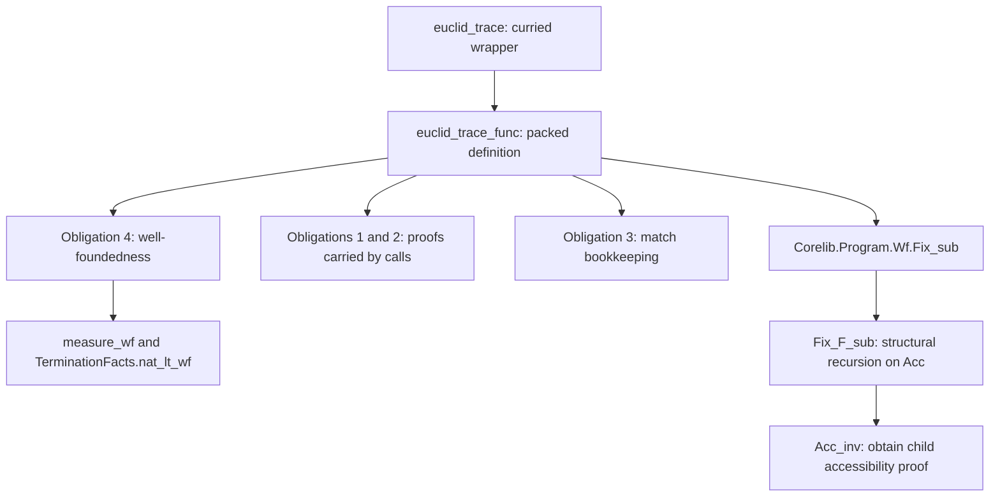

# Termination study: first walkthrough

Start with [L01_Baseline.v](L01_Baseline.v), then visit the files in numerical order. Each is a runnable lesson with explanations, inspection commands, predictions, and a checkpoint. Budget about 1½–2 hours, in separate sittings if useful. The prerequisite is basic familiarity with `Check`, `Print`, pattern matching, and stepping through a proof; accessibility is introduced here.

This is the first installment of the [study brief](study_plan.md): Phase 1 reproduced, followed by the Phase 2 walkthrough. The central question is: how does a termination justification connect to the definition Rocq accepts? The complete example and its supporting proofs are in [Euclid.v](Euclid.v). All study code is contained in this folder and uses only Corelib; compilation and implementation references use the surrounding Rocq checkout. Stop after Lesson 4 for discussion before running the controlled variants or studying native rewrite admission.

| Order | Runnable file | Question to answer before continuing |
| --- | --- | --- |
| 1 · ~20 min | [L01_Baseline.v](L01_Baseline.v) | Why does the plain definition fail, including with either explicit structural argument? |
| 2 · ~30 min | [L02_Obligations.v](L02_Obligations.v) | Where is the decrease proof attached, and when does the function become usable? |
| 3 · ~30 min | [L03_Accessibility.v](L03_Accessibility.v) | How does an accessibility proof supply the structural argument of the actual library recursor? |
| 4 · ~20 min | [L04_Admission.v](L04_Admission.v) | Which term was installed, and which parts produce evidence versus check it? |

Read comments before executing the following command. In Lesson 2, stop at each `Show` and each `Fail Check`; the intermediate states are the lesson. For a small construction exercise, hide the body of `right_call` in Lesson 3 and try rebuilding its nested pair from its type, using the decrease lemma in `Euclid.v`. The checked solution immediately follows the type. The checkpoint answer cues are there for self-checking.

## Run and open the lessons

From this study folder:

```sh
python3 check.py
```

The script first compiles [Euclid.v](Euclid.v), then compiles all four lessons to `.vo` files. It sets `OCAMLPATH` to this checkout's installed libraries and saves commands and output in [logs/](logs/). It records the baseline source's SHA256 and checks that it is unchanged during the run. Generated compilation artifacts are ignored by the repository. From the repository root, the same build is `python3 termination/check.py`.

For an editor that reads `_CoqProject`, open `termination/` as the project. Its [project file](_CoqProject) supplies the logical paths; those paths are relative to this folder. The repository sits directly inside the Rocq source checkout, as described in the [repository guide](../README.md). Select the prover from that checkout and give the editor process the corresponding `OCAMLPATH`; paths relative to this study folder are:

```text
Prover:    ../../_build/install/default/bin/coqtop
OCAMLPATH: ../../_build/install/default/lib
```

`_CoqProject` does not select the executable or set that environment variable. The same checkout also offers `rocq repl`. For a fresh terminal session, run the following **from the study folder**, then enter the lesson's commands in order:

```sh
OCAMLPATH="$PWD/../../_build/install/default/lib" \
  ../../_build/install/default/bin/rocq repl -q -boot \
  -R ../../_build/default/theories/Corelib Corelib \
  -Q . TerminationStudy
```

All modules are under `TerminationStudy`: the lessons import the baseline with `From TerminationStudy Require Import Euclid.` Build once before opening the lessons; Lesson 4 also imports Lessons 2 and 3. Reload/recompile dependencies after editing them.

## Phase 1: reproducibility and result

Recorded on 2026-09-19, at Rocq commit **`67ab16a375d31812dc1dd788f92d446d7d6dcd45`**. The executable reports **Rocq 9.4+alpha, OCaml 5.4.1**. The parent checkout's tracked diff was empty. The generated configuration records `tools/configure/configure.exe -quiet -relocatable`; bytecode compilation is enabled and native compilation is off. Full configuration, compiler flags, source hash, and commands are in [environment.log](logs/environment.log). This records the available build configuration, not a reconstruction of an unavailable original build invocation.

The baseline can be compiled from this study folder with:

```sh
OCAMLPATH="$PWD/../../_build/install/default/lib" \
  ../../_build/install/default/bin/rocq compile -q -boot \
  -R ../../_build/default/theories/Corelib Corelib \
  -Q . TerminationStudy Euclid.v
```

`-q` skips the user rcfile; `-boot` lets the explicit `Corelib` mapping select this checkout, and `-Q` maps this study folder to `TerminationStudy`. The lesson build adds `-test-mode` to retain expected-failure diagnostics. This reporting option is parsed in [sysinit/coqargs.ml](https://github.com/rocq-prover/rocq/blob/67ab16a375d31812dc1dd788f92d446d7d6dcd45/sysinit/coqargs.ml), line 390, and used by [vernac/vernacControl.ml](https://github.com/rocq-prover/rocq/blob/67ab16a375d31812dc1dd788f92d446d7d6dcd45/vernac/vernacControl.ml), lines 207–210. Guard and universe checking remain enabled, as recorded by Lesson 1. No native rewrite opt-in is used.

| Experiment | Observed result | Evidence |
| --- | --- | --- |
| Baseline [Euclid.v](Euclid.v) | Compiles; computations on `(48,18)`, `(18,48)`, `(0,5)`, `(5,0)` return `6,6,5,5`; assumptions are closed | [baseline.log](logs/baseline.log) |
| Plain subtraction algorithm | `Cannot guess decreasing argument of fix.` | [L01_Baseline.log](logs/L01_Baseline.log) |
| Same algorithm with `{struct a}` | Rejects the recursive argument `S a'` where a smaller argument is required | Same log |
| Same algorithm with `{struct b}` | Rejects the recursive argument `S b'` where a smaller argument is required | Same log |
| Four equality examples | Accepted by `reflexivity`; assumptions are closed | Lesson 1 and its log |

The diagnostic about guessing comes from `Pretyping.search_guard`, which tries possible structural arguments and calls the guard machinery. It is an elaboration diagnostic, rather than a direct quotation of a final declaration check. Specifying each argument separately exposes the concrete failures. The accepted measure-based definition uses the arithmetic proofs in `Euclid.v`.

`Print Assumptions` reports no global axioms in these constants' dependencies. Together with the executed examples, that establishes the reported observations under the existing core checks. There is no theorem here that the result is the gcd for every input. For a contrasting algorithm, Corelib explains why its remainder-based gcd passes structural checking at [Init/Nat.v](https://github.com/rocq-prover/rocq/blob/67ab16a375d31812dc1dd788f92d446d7d6dcd45/theories/Corelib/Init/Nat.v), lines 303–311. Our baseline throughout is subtraction-based Euclid.

## Phase 2: trace one call

Use the `then` call from current inputs `S a'` and `S b'`:

```coq
euclid_trace (S a') (S b' - S a')
```

1. **Elaboration restricts the recursive function.** At current inputs `a,b`, the local recursive name has type `forall a0 b0, a0 + b0 < a + b -> nat`. Its call receives an extra proof argument. Obligation 1 contains the match equalities `S a' = a` and `S b' = b`; after substitution, its target is exactly `S a' + (S b' - S a') < S a' + S b'`.
2. **The proof travels with its state.** Program packs the two numbers in `existT`, then packages that state with the decrease proof in `exist`. The underlying recursive-function argument accepts only `{child | weight child < weight parent}`. Lesson 3's `right_call` builds this package explicitly from `TerminationFacts.subtract_right_decreases`. For `(18,48)`, the next state is `(18,30)` and the measure goes from 66 to 48.
3. **Well-foundedness supplies the starting proof.** Obligation 4 is `well_founded (MR lt weight)`. Its proof applies `measure_wf` to `TerminationFacts.nat_lt_wf`, proved in `Euclid.v`. This supplies `Acc` for every initial packed state. The two decrease proofs and the initial accessibility proof have different jobs.
4. **The existing recursor consumes the evidence.** `Fix_sub` invokes `Fix_F_sub` with that accessibility proof. The latter recurses on `r : Acc R x`, as its printed `{struct r}` shows. A call carrying `y` and its proof uses `Acc_inv r (proj2_sig y)` to obtain the child accessibility proof. Unfolding `Acc_inv` exposes the constructor's child-producing function. Lesson 3 proves the actual recursor's one-step equation on `Acc_intro` by reflexivity.
5. **Completion installs the checked term.** Solved obligations are substituted into the pending term. After the final `Defined`, Program declares the packed function and its curried wrapper. Lesson 4 checks, for arbitrary `a,b`, that `euclid_trace a b = euclid_trace_func (pack a b)` by reflexivity.

The `Preterm` and final `Print` outputs are in [L02_Obligations.log](logs/L02_Obligations.log); the core recursor and its structural argument are in [L03_Accessibility.log](logs/L03_Accessibility.log). Keep those dumps as evidence while using the trace above as the reading guide.



**Availability was tested.** Before solving anything, `Check euclid_trace` and `Check euclid_trace_func` both fail. After obligation 1, its evidence constant can be checked and printed while the function remains unavailable. After obligation 3, both function names still fail. After obligation 4, both succeed. The same function computes to 6 on `(18,48)` and has closed assumptions. In an importing client, the generated obligation names require qualification, e.g. `L02_Obligations.euclid_trace_func_obligation_1`; Lesson 4 uses those names.

## Source map for this checkout

Source links and line numbers refer to the commit above. Follow the functions first; there is no need to read entire implementation files.

| Role | Source and entry points | What to look for |
| --- | --- | --- |
| Plain definition: choose/check structural argument | [pretyping/pretyping.ml](https://github.com/rocq-prover/rocq/blob/67ab16a375d31812dc1dd788f92d446d7d6dcd45/pretyping/pretyping.ml), `search_guard`, 96–142; [pretyping/typing.ml](https://github.com/rocq-prover/rocq/blob/67ab16a375d31812dc1dd788f92d446d7d6dcd45/pretyping/typing.ml), `check_fix_with_elims`, 329–339 | Candidate search uses kernel guard machinery; the generic failure message is at 141 |
| Construct the measured term | [vernac/comFixpoint.ml](https://github.com/rocq-prover/rocq/blob/67ab16a375d31812dc1dd788f92d446d7d6dcd45/vernac/comFixpoint.ml), `encapsulate_Fix_sub`, 156–232; `build_wellfounded`, 234–284 | Packed telescope, `MR`, well-foundedness hole, restricted recursive argument, proof-carrying `exist`, wrapper hook |
| Extract obligations and inspect the proposal | [vernac/declare.ml](https://github.com/rocq-prover/rocq/blob/67ab16a375d31812dc1dd788f92d446d7d6dcd45/vernac/declare.ml), `prepare_obligations`, 1113–1127; `show_term`, 2678–2680 | Unresolved evars become obligations; `Preterm` inspects Program state |
| Close an obligation | Same file, `obligation_terminator`, 1677–1706; `declare_obligation`, 1345–1380 | Check/declare evidence and record its body or reference |
| Fill holes and complete the program | Same file, `obligation_substitution`/`subst_prog`, 1530–1538; obligation-level `declare_definition`, 1540–1555; `update_obls`, 1596–1617 | Substitute solved proofs; only zero remaining obligations triggers declaration |
| Pass a complete term to declaration | Same file, general `declare_definition`, 1096–1111; `declare_constant`, 609–682; [library/global.ml](https://github.com/rocq-prover/rocq/blob/67ab16a375d31812dc1dd788f92d446d7d6dcd45/library/global.ml), `add_constant`, 101 | Reject unresolved evars; hand the constant entry to safe typing |
| Kernel declaration checking and installation | [kernel/safe_typing.ml](https://github.com/rocq-prover/rocq/blob/67ab16a375d31812dc1dd788f92d446d7d6dcd45/kernel/safe_typing.ml), `add_constant`, 1181–1213; [kernel/constant_typing.ml](https://github.com/rocq-prover/rocq/blob/67ab16a375d31812dc1dd788f92d446d7d6dcd45/kernel/constant_typing.ml), `infer_definition`, 216–235 | Infer/check body and declared type before adding a transparent definition |
| Check a core recursive term | [kernel/typeops.ml](https://github.com/rocq-prover/rocq/blob/67ab16a375d31812dc1dd788f92d446d7d6dcd45/kernel/typeops.ml), `execute`'s `Fix` case, 768–771; [kernel/inductive.ml](https://github.com/rocq-prover/rocq/blob/67ab16a375d31812dc1dd788f92d446d7d6dcd45/kernel/inductive.ml), `check_one_fix`, 1522 onward, `check_fix_pre_sorts`/`check_fix`, 1865–1897 | Structural-call check and permitted elimination; guard flag consulted at 1876 |
| Library recursion actually used | [theories/Corelib/Program/Wf.v](https://github.com/rocq-prover/rocq/blob/67ab16a375d31812dc1dd788f92d446d7d6dcd45/theories/Corelib/Program/Wf.v), `Fix_F_sub`, 27–29; `Fix_sub`, 31; `MR`, 87; `measure_wf`, 91–104 | Recursion on `Acc`, started with the well-foundedness proof |
| Accessibility itself | [theories/Corelib/Init/Wf.v](https://github.com/rocq-prover/rocq/blob/67ab16a375d31812dc1dd788f92d446d7d6dcd45/theories/Corelib/Init/Wf.v), `Acc`, 33; `Acc_inv`, 38; `well_founded`, 48 | Relation orientation, constructor child proofs, singleton elimination into `Type` |

The elaborator and tactics **produce** terms; their implementations need not be trusted to make those terms logically correct when the resulting declarations pass the existing checks. Kernel typing, conversion, guardedness, and universe handling are part of the trusted checking path. The imported Corelib definitions are part of this experiment's starting environment. `Fix_F_sub` was checked when Corelib was built; declaring Euclid applies that existing constant rather than declaring its recursive body anew. Normal import is not being described as an independent replay or recheck of every library proof.

In the brief's vocabulary, the **substrate** is the core theory and environment, the **proposer** includes the author and proof-producing tools, the **evidence** is the generated proof terms, and the **gate/admission policy** is declaration checking under the existing rules. The **reflective depth** here is term construction within that theory. This trace explains how proof construction can change while the acceptance criterion stays fixed. It establishes no general theorem about replacing the gate or all future admitted histories.

## Documentation comparison and next checkpoint

The linked manuals are for **9.2**, while this checkout is **9.4+alpha**. The observed role of `Preterm`, obligation completion, and accessibility agrees with the [9.2 Program manual](https://rocq-prover.org/doc/V9.2.0/refman/addendum/program.html#coq:cmd.Preterm) and [9.2 Init.Wf](https://rocq-prover.org/doc/V9.2.0/corelib/Corelib.Init.Wf.html). The matching local [Program manual source](https://github.com/rocq-prover/rocq/blob/67ab16a375d31812dc1dd788f92d446d7d6dcd45/doc/sphinx/addendum/program.rst), lines 326–335, describes the same inspection command. The exact recursor used by this example is in **Program.Wf**, beyond the initial **Init.Wf** reading reference.

Two details deserve care. The local Program manual, lines 225–229, describes an extra implicit argument for the recursive name: in this example it appears in the **local recursive prototype**, while the installed public wrapper still has type `nat -> nat -> nat`. Also, the manual's transparency caution at lines 230–241 concerns checking structural recursion through obligations; it does not settle how an opaque accessibility proof affects a chosen evaluation strategy. That is the next experiment, not a result of this walkthrough.

One tooling discrepancy observed here: `rocq compile -help` advertises `-verbose` ([toplevel/coqc.ml](https://github.com/rocq-prover/rocq/blob/67ab16a375d31812dc1dd788f92d446d7d6dcd45/toplevel/coqc.ml), line 28), but this checkout's [argument parser](https://github.com/rocq-prover/rocq/blob/67ab16a375d31812dc1dd788f92d446d7d6dcd45/toplevel/coqcargs.ml), `parse`, rejects it as unknown. The supplied build uses `-test-mode` to retain `Fail` diagnostics instead. This required no source changes to Rocq.

At this checkpoint, explain **why the termination proof enables a term that passes structural checking**. Use the particular package in `right_call` and the printed body of `Fix_F_sub` as evidence. Then consider what remains uncertain:

| Later phase | Planned visit | Evidence still to collect |
| --- | --- | --- |
| 3 | Same-input bad call; changed proof script and measure; separate decrease-proof and well-foundedness opacity experiments; saved-module client | Prove the bad decrease impossible, inspect changed terms, compare ordinary reductions/equalities, and investigate the separate library checker |
| 4 | One-page account of the admission discipline | Separate changes to proof construction, checked environment extension, rebuilding edited definitions, and changes to conversion/trusted code |
| 5 | Isolated native rewrite example and Rewster reading | Trace actual rule admission/reduction, compare implemented checks with the paper's criteria, and investigate interactions and modular confluence before proposing an experiment for Eric |

These later phases are planned, not executed. The native rewrite comparison will use the full 2026 paper if accessible, or explicitly label reliance on the 2024 version, following the original brief. For now, the concrete discussion question is: **which evidence must remain transparent for this particular accepted definition to compute?**
